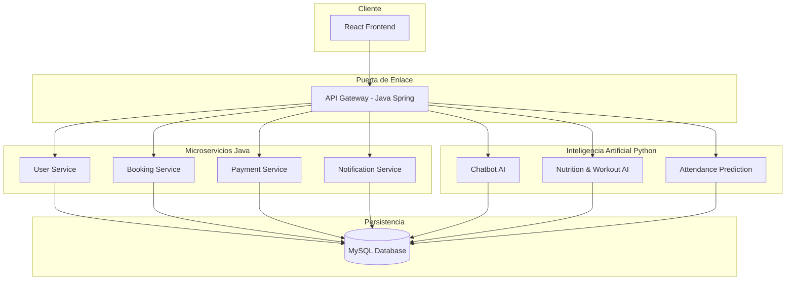

# 🏋️‍♂️ GymManage - Sistema Integral de Gestión de Gimnasios

**GymManage** es una plataforma de grado profesional diseñada para la administración automatizada y optimizada de centros deportivos. El proyecto implementa una arquitectura de **microservicios** escalable, integrando capacidades de **Inteligencia Artificial** para mejorar la retención y experiencia de los socios.

---

## 🏗️ Arquitectura del Sistema

El proyecto destaca por su enfoque multi-lenguaje, permitiendo que cada servicio utilice la herramienta más apta para su tarea:


    ---

## 🚀 Tecnologías Principales

* **Frontend:** React + Vite (Interfaz moderna y reactiva).
* **Backend (Microservicios):** Java Spring Boot (Eureka Server para Service Discovery, API Gateway).
* **Inteligencia Artificial:** Python (Servicios especializados en predicción de asistencia y planes nutricionales).
* **Base de Datos:** MySQL (Estructura relacional robusta).
* **Contenerización:** Docker & Docker Compose (Entorno replicable y listo para despliegue).

## 🛠️ Estructura del Repositorio

* `apps/frontend`: Aplicación cliente para socios y administración.
* `apps/services-java`: Servicios centrales (Pagos, Reservas, Gestión de Usuarios).
* `apps/services-python`: Motores de IA (Chatbot, Análisis de Sentimiento, Vision AI).
* `infrastructure`: Configuración de base de datos, scripts de inicialización y orquestación con Docker.

---

## 🐳 Cómo ejecutar el proyecto

Para levantar todo el ecosistema (Frontend, Backend, IA y Base de Datos) con un solo comando, asegúrate de tener instalado **Docker** y ejecuta en la raíz:

```bash
docker-compose -f infrastructure/docker-compose.yml up --build
```
---

## ✨ Características destacadas

* ✅ **Gestión Completa:** Membresías, facturación y control de accesos.
* ✅ **Reserva Inteligente:** Sistema de reserva de clases y gestión de entrenadores.
* ✅ **IA Integrada:** Análisis preventivo de bajas (Churn) y predicción de afluencia.
* ✅ **Escalabilidad:** Gracias a la arquitectura de microservicios, cada módulo puede crecer de forma independiente.

---
*Proyecto desarrollado con una arquitectura Fullstack moderna y despliegue automatizado.*